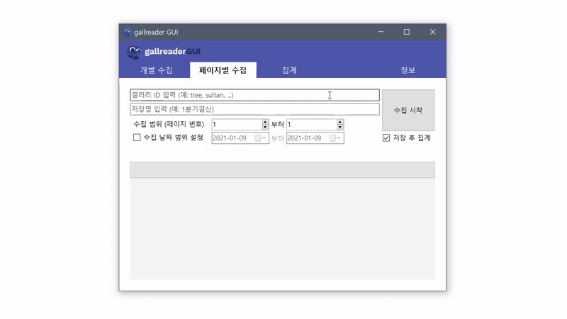

# gallreader-gui

갤리더 - 간단 디시인사이드 글수집, 결산 (갤창랭킹) 프로그램 (GUI)

## TODO
* ~~gallreader 파일 자동 업데이트 (gallreader 리포지토리 release 활용 예정)~~
* ~~결산 (result_arrange) 컨트롤 구현~~
* ~~정보 컨트롤 구현~~
* 도움말 문서 생성
* 도움말 LinkLabel 활성화

## Example

위 캡쳐와 같이 작업을 행하였을때 (페이지 조회, 식물갤(tree), 파일명:save, 2021-1-4~8) 저장된 CSV값:

### save.csv
|Post ID|Title                              |Nickname|IPID    |Date               |Views|Upvotes|HasAccount|
|-------|-----------------------------------|--------|--------|-------------------|-----|-------|----------|
|311658 |아악무? 사랑무? 키우는데 상태가 안좋아요ㅠㅠ 어떻게 해야하나요|ㅇㅇ      |220.127 |2021-01-08 23:37:08|70   |0      |0         |
|311657 |찾아주세요                              |ㅇㅇ      |59.7    |2021-01-08 23:24:25|85   |0      |0         |
|311656 |이 식물 이름 아시는 분 계신가요?                |ㅇㅇ      |110.47  |2021-01-08 23:16:53|70   |0      |0         |
|311655 |이름알수있을까요                           |청\*\*     |h\*\*\* |2021-01-08 23:15:06|44   |0      |1         |
|311654 |아부지가 키우시는 다육이                      |아\*      |a\*\*\*   |2021-01-08 22:52:45|81   |0      |1         |
|311653 |몬스테라 수형교정                          |ㅇㅇ      |122.32  |2021-01-08 22:51:48|56   |0      |0         |
|311652 |배추 9일차                             |아\*      |a\*\*\*   |2021-01-08 22:50:35|42   |0      |1         |
|311651 |방향제 대신 쓸수있는 식물 있을까요?               |ㅇㅇ      |121.152 |2021-01-08 22:35:12|67   |0      |0         |
|311650 |알로에 새끼들                            |ㅇㄹ      |221.164 |2021-01-08 22:24:28|64   |0      |0         |
|311649 |이레카야자에서 이상한 줄기가 나왔는데 이게 뭔지 알려주세요   |ㅇㅇ      |58.124  |2021-01-08 21:34:23|106  |0      |0         |

_(이하 생략)_

### save-arranged.csv
|Nick  |IPID                               |Posts|Upvotes |Views              |HasAccount|
|------|-----------------------------------|-----|--------|-------------------|----------|
|ㅇㅇ(통피)|223.39 223.38 223.62               |17   |6       |2226               |0         |
|ㅇㅇ(통피)|118.235 175.223 39.7 110.70        |11   |0       |959                |0         |
|ㄴㅇㅇㅇ  |59.29                              |7    |0       |845                |0         |
|ㅇㅇ(통피)|211.36 106.102                     |5    |0       |488                |0         |
|ㅇㅇ    |182.221                            |5    |1       |513                |0         |
|소\*\*\*램 |tha\*\*\*                       |4    |0       |364                |1         |
|ㅇㅇ    |106.101                            |4    |0       |334                |0         |
|ㅇㅇ    |182.161                            |4    |2       |394                |0         |
|ㅇㅇ    |211.178                            |3    |0       |189                |0         |
|ㅇㅇ    |118.44                             |3    |3       |288                |0         |

_(이하 생략)_

