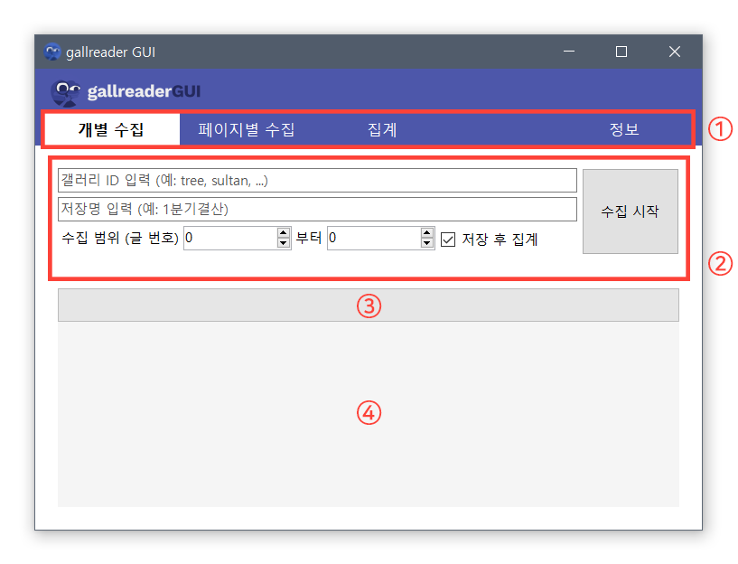

# 도움말

## 빠른 도움말 (클릭)
### [개별 글 수집](postscan)
### [페이지별 수집](pagescan)
### [데이터 결산](arrange)
### 업데이트 하기

## 기본 GUI 설명

### 1. 패널 선택 메뉴
  - 개별 수집 - 글 하나하나를 개별적으로 수집하여 csv파일로 저장
    - 장점: 고닉 추천수, 비추천 수, 글 내용 등 더 많은 정보를 수집할 수 있음, 누락 없이 안정적으로 글을 수집할 수 있음
    - 단점: 비공식 API를 이용하기 때문에 항상 작동을 보장하지 못함, 수집 속도가 느림 (약 4~5글/sec)
  - 페이지별 수집
    - 장점: 매우 빠른 속도로 글을 수집할 수 있음 (약 100~120글/sec), 게시판 페이지를 크롤링하는 것이므로 서버 부담이 적음
    - 단점: 고닉 추천수, 비추천 수, 글 내용과 같은 추가 정보를 수집할 수 없음, 컴퓨터의 사양에 따라 성능 & 안정성이 크게 좌우될 수 있음
  - 집계 - 위 두 가지 방법으로 모은 csv 데이터를 정리하여 사용자별로 집계한 후 csv파일로 저장
    - 수집 패널에서 '저장 후 집계' 옵션을 체크하여 수집 완료 후 자동으로 수행할 수도 있음
    - 여러 csv 파일을 입력하면 프로그램이 병합하여 집계할 수 있음
    - 알려진 다중 아이디, IP가 있을 경우 해당 탭에서 설정하여 저장하면 해당 값에 맞춰 집계를 수행함
  - 정보 - 프로그램 정보, 업데이트
    - 프로그램(gallreader, gallreader-gui)에 관련된 정보를 볼 수 있음
    - 최신 gallreader.exe 빌드 파일을 다운로드 받을 수 있음 - 만약 작업이 실패할 경우, 'gallreader.exe 다운로드/업데이트' 버튼을 눌러 다운받아 다시 시도해 보기를 바람.
    - 프로그램을 사용하면서 오류가 발생하였거나 개선할 사항이 있을 경우, github 페이지 버튼을 클릭하여 이슈 페이지에 보고할 수 있음.
    
### 2. 작업 패널
  - 위 1번 메뉴에서 선택한 메뉴에 따라 패널이 표시됨
  - 대부분의 옵션을 해당 패널의 컨트롤러를 통해 설정할 수 있음
  
### 3. 진행 표시 바
  - 진행되고 있는 작업의 진행도를 파악할 수 있는 표시 바
  - 개별 수집, 페이지별 수집 메뉴에서 볼 수 있음
  - 페이지별 수집의 경우 정확한 수치가 아닌 시간에 따른 글 작성 비율에 따라 계산한 예측값이므로 정확하지 않을 수 있음
  
### 4. 작업 내역 글상자
  - 진행되고 있는 작업의 내역을 출력하는 글 상자
  - 현재 읽고 있는 글/페이지, 진행도, 예상 처리 시간 등을 알 수 있음
  - 오류가 발생하였을 경우 해당 출력 내용을 복사하여 개발자에게 알려주길 바람
  
  
