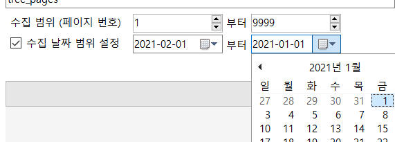
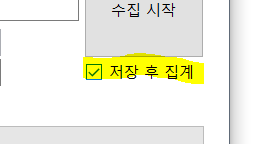

# 페이지별 수집

## 시작하기 전에

### 페이지별 수집이란?
- 개별 수집은 지정한 갤러리의 글 목록 페이지(gall.dcinside.com/board/lists/?id=gall&page=__123__<-이것)를 순차적으로 조회하여 글을 수집하는 방식입니다.
- 글 목록을 통째로 읽는 것이기 때문에 매우 빠른 속도로 글을 수집할 수 있으며, 서버 부담이 적습니다.
- 하지만 비추천 수, 글 내용과 같은 추가 정보를 수집할 수 없으며, 컴퓨터의 사양에 따라 성능 & 안정성이 크게 좌우될 수 있습니다.

### 아래의 경우 추천합니다:
- 많은 글을 단시간 내에 수집해야 할 경우
- 글 작성수, 추천수 랭킹 정도의 간단한 결산만 내면 될 경우
- 

### 결산 시 고려해야 할 다중 ID/IP가 있다면, [집계 메뉴의 사용 방법](/docs/help/arrange)으로 가 다중 목록을 작성하신 뒤 아래 과정을 진행하시기 바랍니다.

## 수집 방법

#### 1. '갤러리 ID 입력'란에 갤러리 ID를 입력합니다.
- gall.dcinside.com/__xxxx__ <- 이 부분의 값을 입력하시면 됩니다.

---

#### 2. csv 파일로 저장할 이름을 입력합니다.
- 확장자는 포함할 필요 없으며, 이미 있는 파일 이름일 경우 덮어 씌웁니다.

---

#### 3. 수집할 페이지 번호 범위를 입력합니다.
- 여기서 '페이지 번호'는 갤러리 페이지 맨 아래의 페이지 번호와 같습니다. (즉, 1페이지가 가장 최근의 페이지입니다.)
- '수집 날짜 범위 설정'을 하신 경우, 맨 마지막 페이지를 99999와 같은 아주 큰 값으로 설정하여도 기간이 초과될 경우 자동으로 수집이 중지됩니다.

---

#### 4. 지정한 날짜 범위 내의 글만 수집하길 원한다면, '수집 날짜 범위 설정'을 체크하여 날짜 범위를 설정합니다.
- 이때 앞 날짜 범위는 뒤 날짜 범위보다 나중에 와야 합니다. 즉, 2021-02-01~2021-01-01 과 같은 식으로 입력되어야 합니다.

---

#### 5. 저장 후 집계 작업을 바로 원할 경우 '저장 후 집계' 항목을 체크합니다. (기본적으로 체크되어 있음)
- 데이터 수집만을 원하거나 3번 항목에서 쪼개어 수집하였을 경우, 체크를 해제하시면 됩니다.

---

#### 6. '수집 시작' 버튼을 눌러 작업을 시작합니다.

---

#### 7. 작업이 진행되는 동안 모든 컨트롤이 비활성화되고 작업 내역이 출력됩니다.

---

#### 8. 작업이 종료되면 다시 컨트롤이 활성화됩니다.

## 문제가 발생한 경우

### 작업 시작에 문제가 있습니다
- gallreader.exe 파일을 제대로 받으셨는지 확인하세요.
- 백신 프로그램 등이 gallreader.exe 파일의 실행을 차단하고 있는지 확인하세요.
- 인터넷에 연결되어 있는지 확인하세요

### 작업은 시작되었으나, 진행 도중에 문제가 발생합니다.
- gallreader.exe 파일을 최신 버전으로 다시 받아보세요.
- 다른 범위로 우선 수집하여 보고, '개별 조회' 로 시도해 보세요.
- 여전히 문제가 지속된다면 [이슈 페이지](https://github.com/pdjdev/gallreader-gui/issues)에 작업 내역과 함께 보고해 주세요.

