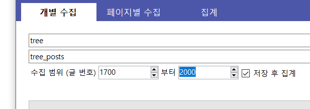

# 개별 수집

## 시작하기 전에

### 개별 수집이란?
- 개별 수집은 지정한 글 ID (gall.dcinside.com/gallid/__12345__<-이것) 범위 내에서 차례대로 글을 조회하여 수집/저장하는 방식입니다.
- 페이지 수집에서는 조회할 수 없는 비추천 수, 글 내용 등을 수집할 수 있으며, 유동적으로 변하는 게시판 페이지와 달리 글 ID를 기준으로 수집하기 때문에 글을 누락하지 않고 정확하게 수집할 수 있습니다.
- 하지만 페이지별 수집에 비해서 시간이 상당히 오래 걸리며, 비공식 API를 사용하기 때문에 항상 작동을 보장할 수 없습니다.

### 아래의 경우 추천합니다:
- 수집할 내용이 그렇게 많지 않을 경우 (1000글 이내 -> 1000글/4 = 약 4~5분 소요)
- 비추천 랭킹과 같이 페이지 수집으로는 불가능한 정보를 수집해야 할 경우
- 키워드 조사, 검색과 같은 데이터 분석 용도로 사용해야 할 경우

### 결산 시 고려해야 할 다중 ID/IP가 있다면, [집계 메뉴의 사용 방법](../arrange)으로 가 다중 목록을 작성하신 뒤 아래 과정을 진행하시기 바랍니다.

## 수집 방법

#### 1. '갤러리 ID 입력'란에 갤러리 ID를 입력합니다.
- gall.dcinside.com/__xxxx__ <- 이 부분의 값을 입력하시면 됩니다.

---

#### 2. csv 파일로 저장할 이름을 입력합니다.
- 확장자는 포함할 필요 없으며, 이미 있는 파일 이름일 경우 덮어 씌웁니다.

---

#### 3. 글 수집 범위를 입력합니다.
- gall.dcinside.com/xxxx/__123456__ <- 이 부분의 값을 입력하시면 됩니다.
- 예를 들어, 1700과 2000을 차례대로 입력한 경우, 1700번부터 2000번까지의 글을 순차적으로 조회합니다.
- 10000개 이상의 많은 글을 조회할 경우, 1~5000 / 5000~10000 과 같은 식으로 쪼개어 수집하시기 바랍니다. (이렇게 분할하여 수집한 데이터는 '결산' 탭에서 병합하여 결산 작업을 할 수 있습니다)

---

#### 4. 저장 후 집계 작업을 바로 원할 경우 '저장 후 집계' 항목을 체크합니다. (기본적으로 체크되어 있음)
- 데이터 수집만을 원하거나 3번 항목에서 쪼개어 수집하였을 경우, 체크를 해제하시면 됩니다.

---

#### 5. '수집 시작' 버튼을 눌러 작업을 시작합니다.

---

#### 6. 작업이 진행되는 동안 모든 컨트롤이 비활성화되고 작업 내역이 출력됩니다.

---

#### 7. 작업이 종료되면 다시 컨트롤이 활성화됩니다.

## 문제가 발생한 경우

### 작업 시작에 문제가 있습니다
- gallreader.exe 파일을 제대로 받으셨는지 확인하세요.
- 백신 프로그램 등이 gallreader.exe 파일의 실행을 차단하고 있는지 확인하세요.
- 인터넷에 연결되어 있는지 확인하세요

### 작업은 시작되었으나, 진행 도중에 문제가 발생합니다.
- gallreader.exe 파일을 최신 버전으로 다시 받아보세요.
- 다른 범위로 우선 수집하여 보고, '페이지별 조회' 로 시도해 보세요.
- 여전히 문제가 지속된다면 [이슈 페이지](https://github.com/pdjdev/gallreader-gui/issues)에 작업 내역과 함께 보고해 주세요.

